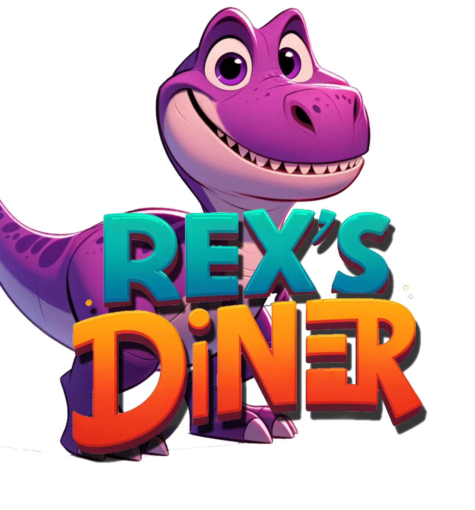
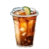
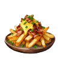
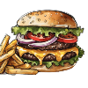
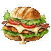
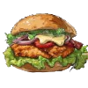
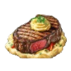

<html>
<head>
  <title>Menu Calculator</title>
    
  
</head>
<body>
	

 
<body style="background-color:grey;">
	
  <h1>Rex's Diner Calculator</h1>
  
  <h2>Menu Items</h2>

  

  
  <h3>Drinks</h3>
  <!-- Individual items -->
  

  <input type="checkbox" id="uwueats" value="200$">
  <label for="Velmachoice">Motor Oil Coffee - 200$</label>
  <input type="number" value="1" min="1">
  

  

  <input type="checkbox" id="Davechoice" value="150$">
  <label for="Davechoice">Engine Coolant Ice Tea - 150$</label>
  <input type="number" value="1" min="1">
  

  

  <input type="checkbox" id="Davechoice" value="100$">
  <label for="Davechoice">eCola - 100$</label>
  <input type="number" value="1" min="1">

   

  <input type="checkbox" id="Davechoice" value="100$">
  <label for="Davechoice">Sprunk - 100$</label>
  <input type="number" value="1" min="1">

  

  <input type="checkbox" id="Davechoice" value="200$">
  <label for="Davechoice">Radiator Flush Lemonade - 200$</label>
  <input type="number" value="1" min="1">

<h3>Main Dish</h3>

<input type="checkbox" id="uwueats" value="100$">
<label for="Velmachoice">Garage Fries - 100$</label>
<input type="number" value="1" min="1">

<input type="checkbox" id="uwueats" value="100$">
<label for="Velmachoice">Piston Poppers - 100$</label>
<input type="number" value="1" min="1">

<input type="checkbox" id="uwueats" value="100$">
<label for="Velmachoice">Gasket Quesadillas - 100$</label>
<input type="number" value="1" min="1">

 

<input type="checkbox" id="uwueats" value="100$">
<label for="Velmachoice">Spare Tire Tots - 100$</label>
<input type="number" value="1" min="1">

<input type="checkbox" id="uwueats" value="100$">
<label for="Velmachoice">Dipstick Dippers - 100$</label>
<input type="number" value="1" min="1">

<input type="checkbox" id="uwueats" value="100$">
<label for="Velmachoice">Oil Change Onion Ringa - 100$</label>
<input type="number" value="1" min="1">

<input type="checkbox" id="uwueats" value="225$">
<label for="Velmachoice">Clutch Burger - 225$</label>
<input type="number" value="1" min="1">

<input type="checkbox" id="uwueats" value="225$">
<label for="Velmachoice">Carburetor Grilled Chicken Sandwich - 225$</label>
<input type="number" value="1" min="1">
	

<input type="checkbox" id="uwueats" value="225$">
<label for="Velmachoice">Carburetor Fried Chicken Sandwich - 225$</label>
<input type="number" value="1" min="1">
	

<input type="checkbox" id="uwueats" value="225$">
<label for="Velmachoice">Fuel Line Frank - 225$</label>
<input type="number" value="1" min="1">

<input type="checkbox" id="uwueats" value="225$">
<label for="Velmachoice">V8 Steak Charger - 225$</label>
<input type="number" value="1" min="1">

  <h3>Refuel</h3>

  

    <input type="checkbox" id="uwueats" value="175$">
    <label for="Velmachoice">Chocolate Milkshake Manifold- 175$</label>
    <input type="number" value="1" min="1">
    
  

   

    <input type="checkbox" id="uwueats" value="175$">
    <label for="Velmachoice">Chocolate Milkshake Manifold- 175$</label>
    <input type="number" value="1" min="1">
    
  

   

    <input type="checkbox" id="uwueats" value="175$">
    <label for="Velmachoice">Chocolate Milkshake Manifold- 175$</label>
    <input type="number" value="1" min="1">
    
  

   

    <input type="checkbox" id="uwueats" value="175$">
    <label for="Velmachoice">Wrench Waffles- 175$</label>
    <input type="number" value="1" min="1">
    
  

   

    <input type="checkbox" id="uwueats" value="175$">
    <label for="Velmachoice">Battery Boost Brownie Sundae- 175$</label>
    <input type="number" value="1" min="1">
    
  

  <h3> Employee Discount</h3> 

  <input type="checkbox" id="25off" value="-25%">
  <label for="50off">Employee Discount - 25% off</label>
  <input type="number" value="1" min="1" max="1">

    <label for="name">Rex's Employee Name:</label>
    <input type="text" id="name">
  

  

 

  Total: $
  0.00

  Commision (15%): $
  0.00

 
  

  

  <button class="calculate-button" onclick="calculateTotal()">Calculate Total</button>
  <button class="submit-button" onclick="submitAndReset()">Submit Order</button>
  <button class="reset-button" onclick="resetCalculator()">Reset</button>

 
  
  
  

